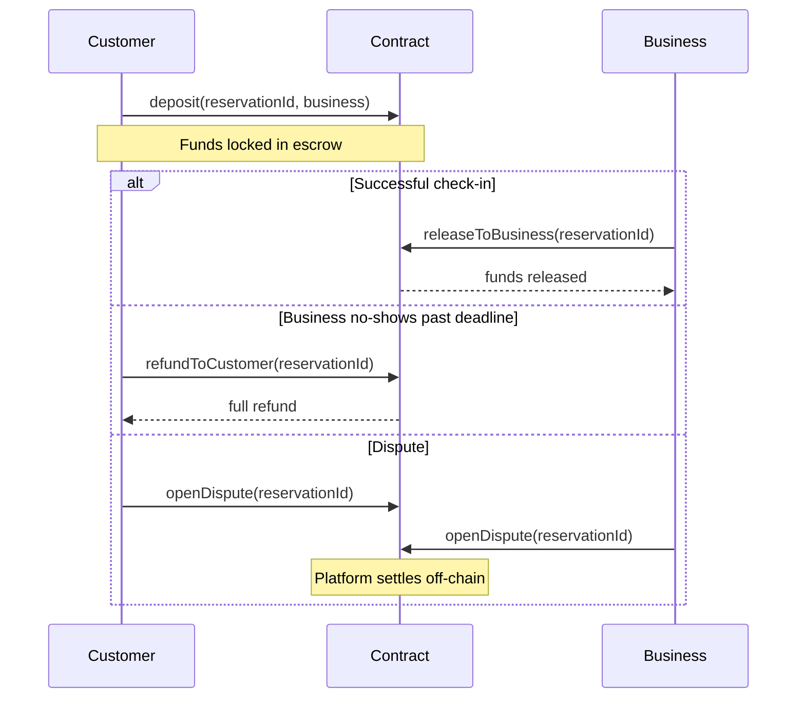

# PabandiEscrow — BuildAnything Spark 2025 Hackathon

Monad Testnet Escrow Contract for booking reservations.

---

## What is this?

`PabandiEscrow.sol` is a Solidity escrow contract built for the [BuildAnything Spark 2025 hackathon](https://buildanything.so/hackathons/spark). It is the onchain component of [Pabandi](https://pabandi-42c5b.web.app) — an agentic AI booking ecosystem that protects SMEs in high-friction markets (Pakistan) from no-shows and COD fraud.

**Problem solved:** When a customer books a hotel table, salon chair, or restaurant reservation, there is no financial incentive to actually show up. Pabandi changes that by requiring customers to deposit funds to hold the booking, and pays the business only after successful check-in.

---

## Contract Address

Network: **Monad Testnet**

Address: *(deploying during hackathon window — will be pinned here)*

---

## Transaction Flow



---

## Functions

| Function | caller | Description |
|---|---|---|
| `deposit(reservationId, business)` | Customer | Lock MON in escrow for a booking |
| `releaseToBusiness(reservationId)` | Business | Claim funds after successful check-in |
| `refundToCustomer(reservationId)` | Customer | Full refund if business no-shows past 48h deadline |
| `openDispute(reservationId)` | Either party | Flag a disputed reservation for platform review |
| `getReservation(reservationId)` | Anyone | Read booking state off-chain |

---

## Security

- Custom errors (gas efficient)
- Role-based modifiers (onlyCustomer / onlyBusiness)
- Reentrancy-safe via Chekhov-style balance nulling
- Deadline-enforced refund (48h after expected check-in)
- Funds held in contract — no external vaults

---

## Tech Stack

- **Language:** Solidity ^0.8.20
- **Framework:** Foundry 1.7.1
- **Chain:** Monad Testnet
- **Consumer App (frontend):** React + TypeScript + TailwindCSS (live at https://pabandi-42c5b.web.app)

---

## Build

```bash
git clone https://github.com/jweezy119/Pabandi-Escrow
cd Pabandi-Escrow
forge build
```

## Deploy (Monad Testnet)

```bash
forge create contracts/PabandiEscrow.sol:PabandiEscrow \
  --rpc-url https://testnet-rpc.monad.xyz \
  --private-key $PRIVATE_KEY
```

---

## About the Sponsor

Pabandi is a Dual-Engine Trust Ecosystem:

1. **Consumer App** (Pakistan — live on Firebase): booking platform for salons, clinics, and live sellers. Generates on-chain reliability behavior data in real time.
2. **Zero-Knowledge Fraud Network API**: global B2B API layer that lets Shopify, TikTok Shop, and Daraz block COD fraud without violating consumer privacy.

Learn more: https://pabandi-42c5b.web.app

---

## License

MIT
